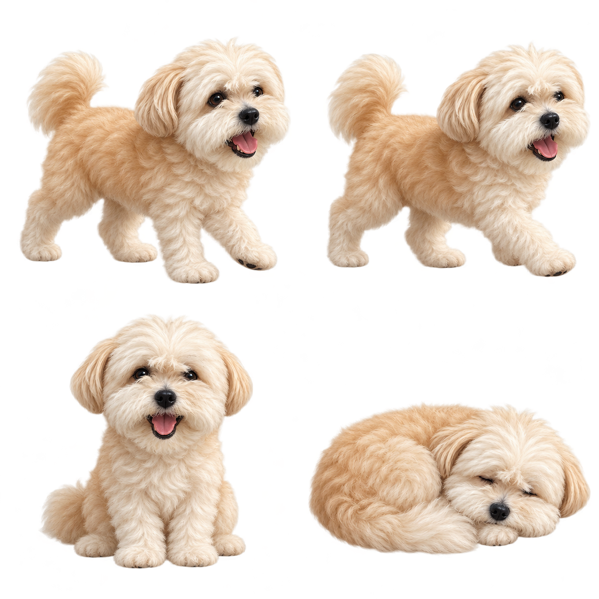

# Aji Pet 🐾

사진 속 강아지를 바탕으로 만든 작은 macOS 데스크톱 펫입니다. 투명 배경으로 화면 위를 산책하고, 쉬거나 잠들며, 클릭하면 하트로 반응합니다.



## 요구 환경

- Apple Silicon Mac
- macOS 13 Ventura 이상
- 빌드 시 Xcode Command Line Tools 필요

## 빌드 및 실행

```sh
git clone git@github.com:HEMMO0208/aji_pet.git
cd aji_pet
./AjiPet/build.command
open "Aji Pet.app"
```

완성된 `Aji Pet.app`을 응용 프로그램 폴더로 옮겨 사용할 수 있습니다. 실행에는 Codex, 계정, API 키, 인터넷 연결이 필요하지 않습니다.

## 조작

- 클릭: 쓰다듬기와 하트 반응
- 드래그: 위치 이동
- 우클릭 또는 메뉴 막대의 발바닥 아이콘: 산책, 낮잠, 일시정지, 크기 변경, 숨기기, 종료
- 화면 아래로 데려오기: 위치 초기화

AI로 만든 캐릭터 이미지와 로컬 애니메이션을 사용하는 앱이며, 대화형 언어 모델은 포함하지 않습니다. 로그인 시 자동 실행은 설정하지 않습니다.

## 프로젝트 구성

- `AjiPet/Sources/main.swift`: AppKit 앱과 애니메이션
- `AjiPet/Info.plist`: 앱 번들 설정
- `AjiPet/Assets/pet-sheet.png`: 투명 배경 캐릭터 이미지
- `AjiPet/image-prompt.txt`: 이미지 제작 프롬프트
- `AjiPet/build.command`: Apple Silicon 빌드 및 로컬 서명

프로젝트 루트의 `IMG_*.JPG` 11장은 캐릭터 제작을 위한 원본 강아지 사진입니다. 빌드한 앱과 배포 ZIP은 Git에 포함하지 않습니다.

## 다른 Mac에 전달하기

앱을 ZIP으로 압축해 전달하면 됩니다. 앱은 로컬 서명되며 Apple 공증을 받지 않았으므로, 다른 Mac에서 처음 실행할 때 개발자 확인 경고가 표시될 수 있습니다. 직접 받은 파일임을 확인한 뒤 [Apple 공식 실행 안내](https://support.apple.com/ko-kr/102445)를 참고하세요.
